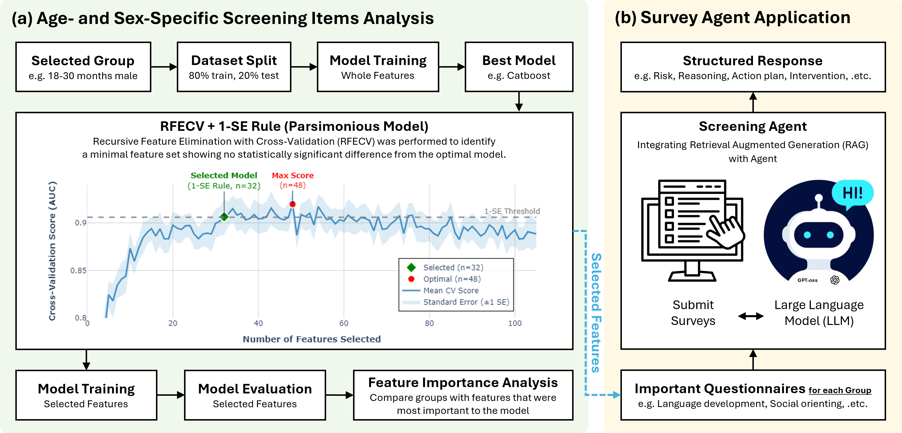

# 🧩 ASD-Screening Agent

## 📌 Project Overview

**ASD-Screening Agent** is a parent-facing digital pre-screening support tool for early Autism Spectrum Disorder (ASD) detection in toddlers aged 18–48 months.

This project is based on the research paper:
> *"Age- and Sex-Specific Autism Screening: Machine Learning-Based Reduction and Conversational Agent Integration"*
> Kim et al. (Seoul National University Hospital, et al.)



Using a dataset of **1,400 children** (443 typically developing, 457 high-risk, 500 ASD) collected across **9 hospitals in South Korea**, we applied machine learning to identify age- and sex-specific screening items across four demographic subgroups (18–30 months / 31–48 months × male / female). The reduced item sets are integrated into a **Retrieval-Augmented Generation (RAG)** conversational agent that translates screening results into structured, evidence-based parental guidance — without providing a definitive medical diagnosis.

---

## 🔬 Research Background

ASD affects approximately 1 in 36 children globally, yet many children are not diagnosed until after age 6 due to the limitations of traditional diagnostic workflows. Parent-reported screening questionnaires offer a practical first step, but existing tools often:

- Impose excessive respondent burden with lengthy item sets
- Apply uniform item sets that fail to capture sex-specific or developmentally-specific ASD presentations
- Overlook high-risk (HR) populations by focusing only on binary TD vs. ASD classification

This project addresses all three challenges through **stratified feature reduction** and **generative AI-based guidance delivery**.

---

## 🧠 Machine Learning Approach

### Questionnaires Used

| Age Group | Questionnaires |
|-----------|----------------|
| 18–30 months | M-CHAT, Q-CHAT, BeDevel-I, BeDevel-P |
| 31–48 months | SCQ, SRS-2, BeDevel-I, BeDevel-P |

### Classification Pipeline

A **two-stage hierarchical classification** framework was implemented:

- **Stage 1**: Typically Developing (TD) vs. Others (HR + ASD)
- **Stage 2**: High-Risk (HR) vs. ASD

Feature selection used **Recursive Feature Elimination with Cross-Validation (RFECV)** combined with the **one-standard-error (1-SE) rule** to identify the most parsimonious set of items without statistically significant loss in performance.

### Key Results (Reduced Feature Sets)

**Stage 1 — TD vs. Others:**

| Age | Sex | # Features | AUROC |
|-----|-----|-----------|-------|
| 18–30 mo | Male | 13 | 0.856 ± 0.014 |
| 18–30 mo | Female | 8 | 0.701 ± 0.023 |
| 31–48 mo | Male | 14 | 0.864 ± 0.015 |
| 31–48 mo | Female | 10 | 0.916 ± 0.007 |

**Stage 2 — HR vs. ASD:**

| Age | Sex | # Features | AUROC |
|-----|-----|-----------|-------|
| 18–30 mo | Male | 15 | 0.858 ± 0.026 |
| 18–30 mo | Female | 13 | 0.767 ± 0.139 |
| 31–48 mo | Male | 14 | 0.870 ± 0.004 |
| 31–48 mo | Female | 8 | 0.885 ± 0.014 |

Standard questionnaires were reduced to **8–15 critical items per subgroup** with no statistically significant drop in diagnostic accuracy (all p-values > 0.05).

---

## 🤖 RAG-Based Agent

### Architecture


The agent is powered by a **Retrieval-Augmented Generation (RAG)** architecture using the **gpt-oss (120B parameters)** Large Language Model. The knowledge base consists of a curated vector database with **24 clinical sources**:

- 24 peer-reviewed research papers on ASD behaviors

### Agent Output Structure

For each screening session, the agent generates a **standardized six-part response**:

1. **Risk Classification** — High / Medium / Low
2. **Reasoning Summary** — Synthesis of behavioral evidence from responses
3. **Prioritized Action Plan** — Distinguishes medical urgency from monitoring needs
4. **Home-based Interventions** — Specific observation points and practical parenting tips
5. **Uncertainty & Limitations** — Notes on data sufficiency and screening boundaries
6. **Empathetic Closing** — Emotional support and clear next steps

> ⚠️ The agent strictly prohibits definitive medical diagnosis and focuses on pre-screening guidance and referral support.

### Expert Evaluation

The agent was evaluated by **8 pediatric mental health clinicians** on 20 randomly sampled cases (5 per demographic group) using a **5-point Likert scale** across six dimensions:

| Dimension | Description |
|-----------|-------------|
| Clarity | Understandability of the explanation |
| Clinical Validity | Alignment with DSM-5 criteria |
| Structural Consistency | Logical link between survey features and advice |
| Reliability | Trustworthiness of the response |
| Usability | Practicality for parental recommendation |
| Safety | Avoidance of over-diagnosis or inducing excessive anxiety |

Results demonstrated **high clinical validity and safety** in translating screening results into actionable parental guidance.

---

## ⚙️ Installation

### 1. Clone the Repository

```bash
git clone https://github.com/DYDevelop/Age-and-Sex-Specific-Questionnaire-Chatbot.git
cd Age-and-Sex-Specific-Questionnaire-Chatbot
```

### 2. Set Up Conda Environment

```bash
conda env create -f environment.yaml
conda activate langchain
```

### 3. Install Ollama (for local LLM, Ubuntu)

See the official site for installation instructions: https://ollama.com

---

## 🚀 Running the Application

### Streamlit

```bash
cd app
streamlit run app.py                  # Local Ollama-based
```

---

## 💡 Key Features

- 🔍 **Stratified Screening** — Age- and sex-specific item sets (8–15 items per subgroup) derived from M-CHAT, Q-CHAT, SCQ, and SRS-2
- 🧠 **RAG Knowledge Base** — Vector database of 24 clinical sources including DSM-5 guidelines
- 💬 **Structured Six-Part Output** — Clinically validated response format for parental guidance
- 🧱 **Local LLM Inference (Ollama)** — LangChain + Ollama RAG pipeline, operable without internet
- 🔒 **Safe & Non-Diagnostic** — Prompt-engineered to avoid over-diagnosis and unwarranted clinical conclusions
- ⚙️ **Multi-Interface Support** — Streamlit or Gradio UI, selectable per use case

---

## 🖥️ System Requirements

| Component | Requirement |
|-----------|-------------|
| OS | Ubuntu 20.04 or later (recommended) |
| GPU | ≥ 15GB VRAM (e.g., RTX 3090) |
| RAM | ≥ 32GB |
| Storage | ≥ 5GB free space |
| Python | 3.9 or later |
| Other | Conda recommended; Ollama required for local LLM |

---

## 📂 Project Structure

```bash
Age-and-Sex-Specific-Questionnaire-Chatbot/
├── docs/                          # Knowledge base documents (PDF, DOCX, TXT)
│   └── *.pdf                      # ASD research papers (24 documents)
├── app/                           # Application scripts
│   ├── chroma_db/                 # Vectorized document cache (ChromaDB)
│   └── app.py                     # Streamlit (local Ollama)
├── environment.yaml               # Conda environment specification
└── README.md                      # Project documentation
```

---

## 📖 Citation

If you use this work, please cite:

> Kim DY, Sim H, Choi J, et al. *Age and Sex Specific Autism Screening Using Machine Learning Reduction and Conversational Agent Integration* (2026)

---

## ⚖️ Ethics & Disclaimer

This tool was developed under IRB approval from 9 participating hospitals in South Korea. It is intended solely as a **pre-screening support tool** to assist parents and facilitate timely referral. It does **not** constitute a medical diagnosis and should not replace professional clinical evaluation.
